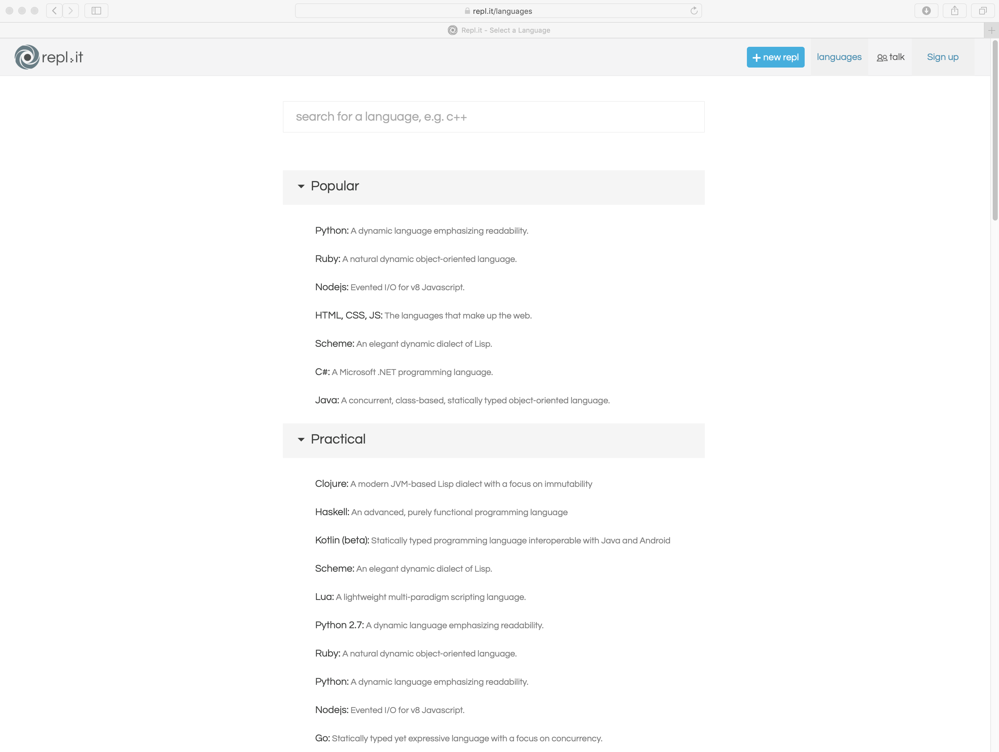
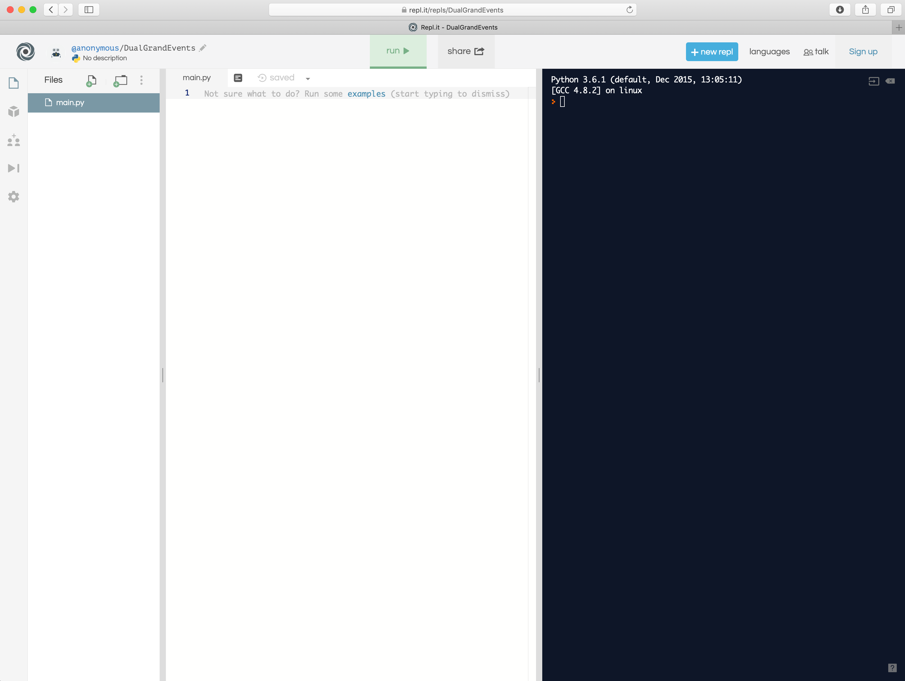
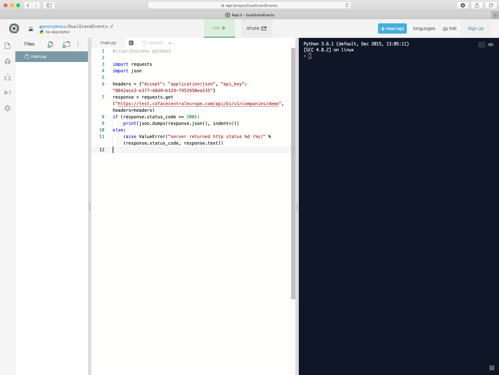
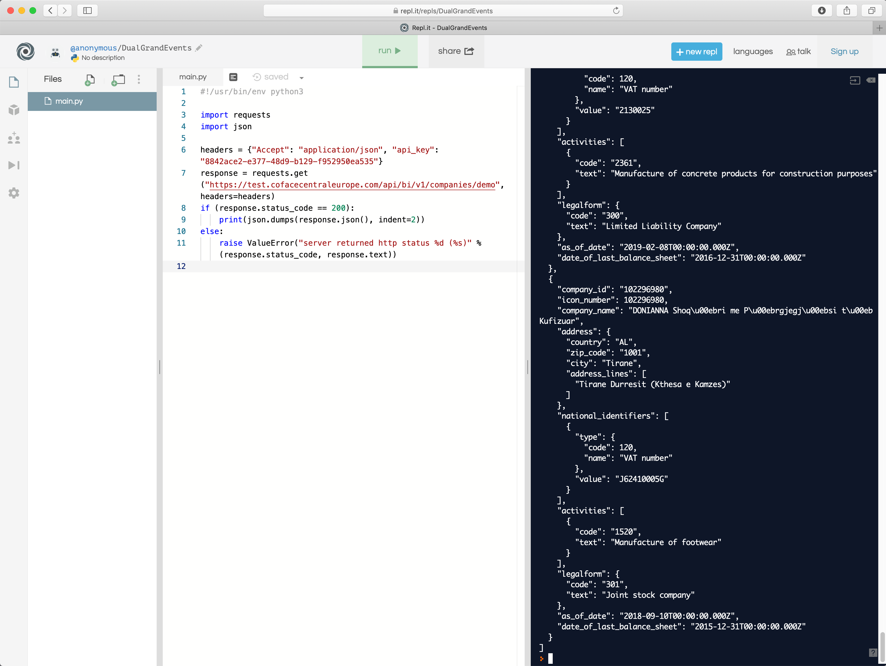

# Python samples

These python scripts illustrate how to use the various API methods in the API.

To run them, you'll need Python 3 installed on your machine.

Alternatively, you can try them out with an online python IDE like https://repl.it

Point your browser at https://repl.it/languages

Select Python

Paste the sample code in (in this example, we're pasting the contents of getDemoCompanies.py)

Click run

